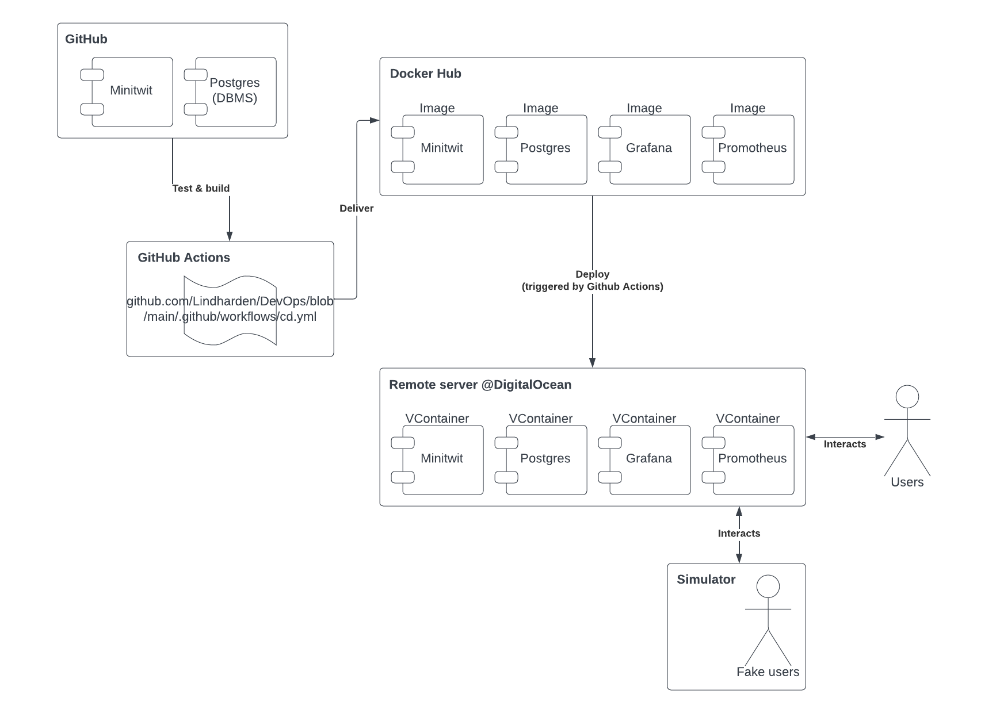

# Lecture 7: Software Quality, Maintainability & Technical Debt
[Week 7](https://github.com/itu-devops/lecture_notes/blob/master/sessions/session_07/README_TASKS.md)

## Add tests to your CI chain
Tests have been added to our CI/CD setup. Our CI/CD actions script contains the following lines, which runs all our Go unit tests:
```yaml
# Run go unit tests
- name: Unit testing
run: |
    go test -v ./...
# Run simulator integration tests
- name: Simulator tests
run: |
    pip install -r ./tools/requirements.txt
    pytest ./tools/test_sim_compliance.py
```

## Enhance your CI Pipelines with at least three static analysis tools
In our CI/CD setup we have included three static analysis tools. These tools help ensure high software quality and maintainability. The three static analysis tools we have implemented are:
 
[Lint](https://github.com/golang/lint) for Go - helps flagging programming errors, bugs and stylistic errors. Runs from the following action:
```yaml
#Run linter to check if new code follows the style guidelines
- name: lint
run: if [ "$(gofmt -s -l . | wc -l)" -gt 0 ]; then exit 1; fi
```

[CodeQL](https://codeql.github.com/) - for flagging vulnerabilities across the codebase. Defined in [codeql.yml](https://github.com/Lindharden/DevOps/blob/main/.github/workflows/codeql.yml).

[Snyk](https://snyk.io/) - for finding and fixing vulnerabilities in our dependencies. Snyk is integrated with Github through their webapp and runs automatically on every push to the repository.

## Add Maintainability and Technical Debt estimation tools to your projects
We added [Sonarqube](https://www.sonarsource.com/products/sonarcloud/) and [Code Climate](https://codeclimate.com/) to our application. These tools will create comments on our pull-requests, detailing any potential problems with the committed code. Additionally we can visit the websites to view detailed statistics and improvements which are proposed to our code.

## Mapping subsystems
The following UML diagram maps all the subsystems of our Minitwit application.

