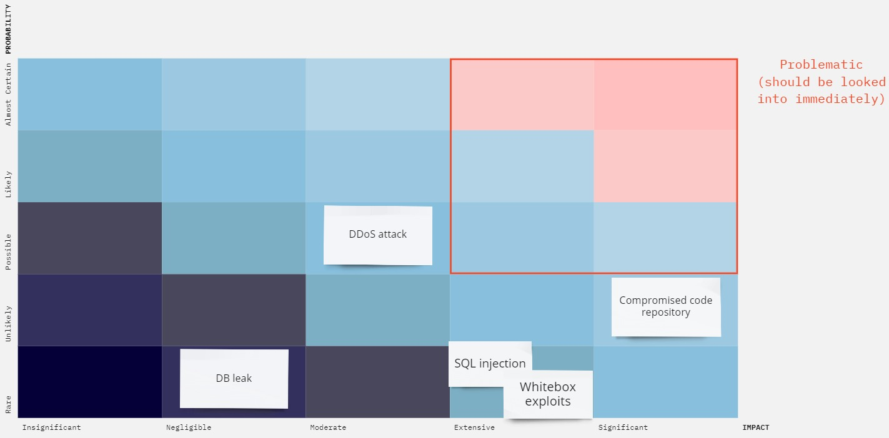
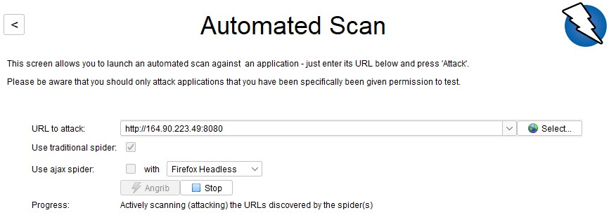

# Lecture 9: Security
[Week 9](https://github.com/itu-devops/lecture_notes/blob/master/sessions/session_09/README_TASKS.md)

## Security Assessment

Available **assets** are: 
 - Go Application
 - Grafana (used as monitoring dashboard)
 - Prometheus (used for fetching monitoring metrics)
 - Kibana (used for logging dashboard)
 - Elasticsearch (extracts logs from application)
 - Filebeat (forwards logs to Elasticsearch)
 - GitHub (version control system)
 - Digital Ocean (application hosting)
 - DockerHub (Stores container images)

We identified the following **threat sources** in our application:
 - Compromised code repository
 - Whitebox exploits due to public repository
 - Denial-of-service (DDOS)
 - SQL injection
 - DB leak

The following **risk scenarios** are constructed from our identified threats and assets:
 - An attacker gains access to one of our GitHub accounts that has “admin” status on our code repository. This could either happen by one of us having a weak password on our GitHub account with no two-factor authentication, or getting one of our phones/computers, which are logged into GitHub, stolen/hijacked. When the attacker has admin access to our GitHub repository, they can freely change or add malicious code to our repository. This could e.g. be changing our CI/CD pipeline such that the database is sent to a remote server. The attacker could also remove access from everyone else and hijack the entire repository to create a ransom attack.

 - After looking through our publicly available code hosted on GitHub (or through trial and error), they might discover some input field which could be exploited through SQL injection. The attacker then sends requests to obtain sensitive information about the users of the application. 

 - An attacker decides to DoS our service by sending many requests at once, which would overload the processor which runs the application at DigitalOcean. This would make the application unresponsive/unreachable for some time. If this happens often, users might start to leave minitwit.

### Risk Analysis

Here we perform a risk analysis of our identified threat sources.

The **likelihood** of a threat occurring is determined on a scale consisting of the following levels of likelihood: `Rare`, `Unlikely`, `Possible`, `Likely`, `Almost certain`.

 - **[Unlikely] Compromised GitHub repository**: The github repository owner uses two-factor authentication. Furthermore, all users must make a pull request and have it approved to change the code on the main branch. This makes it unlikely that the github repository is compromised.

 - **[Rare] Whitebox exploits**: As our GitHub repository is public, anyone can see our code and create exploits for it. Therefore if the attacker finds a reason and an opportunity to create a whitebox exploit, it would likely happen. However, as we continuously update our code and update vulnerable packages the chance of an exploit being possible, is very low.

 - **[Possible] DDoS attack**: Since our application isn’t that popular it isn’t so likely that we get DDoS’ed, but it is still possible since our application is public.. 

 - **[Rare] SQL injection**: Since the database abstraction layer library GORM sanitizes all keywords, an SQL injection attack is very rare, basically impossible.

 - **[Rare] DB leak**: The only ways our database can be leaked, is by someone compromising our code repository and performing some kind of whitebox exploit, or by performing SQL injection. As we deemed these risks as “rare”, our database leaking must also be a rare event.

The **impact** of a threat is rated on a scale consisting of the following impact levels: Insignificant, Negligible, Moderate, Extensive & Significant.

 - **[Significant] Compromised GitHub repository**: A compromised GitHub repository would mean that the attacker would gain access to one of our GitHub admin accounts, which would mean they have the ability to change our code. This means they can implement something malicious in our CI/CD pipeline, or reroute paths.	This means that this threat source has a high impact.

 - **[Extensive] Whitebox exploits**: Our GitHub repository is public, meaning everyone can see our code. Having the ability to see our code/implementation means that an adversary could create exploits which are customized for our implementation, which could increase the likelihood of the exploit succeeding. As the attacker knows what our codebase looks like they can plan their attacks towards having as large of an impact as possible. In addition, the attacker can see all the dependencies we use, meaning they can utilize any exploits found in our dependencies.

 - **[Moderate] DDoS attack**: A DDoS attack would mean that our application would be unreachable for a period of time. This would be a moderate inconvenience for us and our users.

 - **[Extensive] SQL injection**: SQL injection would mean that an attacker performs attacks directly on our database, by sending arbitrary SQL queries to our database. 

 - **[Negligible] DB leak**: If our database leaked, the attacker would gain access to usernames, email’s and hashed passwords of our users. As none of this is sensitive information the impact would be negligible. However, the hashed passwords could be used in an brute-force attempt to identify passwords.

### Risk Matrix & Risk Assessment
Given the likelihood and impact of each identified risk, we can construct the following risk matrix:

We defined the square marked with orange as the level required for an alert, that is, risks need to be at least `Extensive` and `Possible` for us to take up the case immediately.

Risks outside of this threshold should still be considered, but pose no immediate danger. Therefore we can simply accept the risks.

### Improvements

To decrease the likelihood of our GitHub repository getting compromised, we will all be setting up 2 factor authentication on our GitHub accounts, to prevent unauthorized access to our personal accounts. Several measures have already been taken for this threat, such as disallowing pushes to the main branch without reviews.

Ideally we would also make our repository private to not allow whitebox exploits. Yet this is not possible as our repository is required to be public for the course.

We have enabled Depandabot to circumvent the possibility of running our application with a vulnerability. We will be alerted on GitHub if Dependabot finds a vulnerable dependency. 

## Penetration Test of our System

We automated the penetration testing through [OWASP ZAP](https://www.zaproxy.org/). We used the automatic scan tool on our web-application, using the default spider.

The spider explored the endpoints listed in: <docs/OWASP_ZAP/report_290323/explored.csv>, and ZAP generated the following report: <docs/OWASP_ZAP/report_290323/2023-03-29-ZAP-Report-.html>. As it can be seen in the report, no major flags/alerts were found. The only `Medium` level alerts which was found, was caused by some missing headers and tokens in our responses.

More specifically it can be seen that our responses lack CSP (Content-Security Policy) headers, which is an added layer of security that help mitigate Cross Site Scripting (XSS) and data injection attacks. Our forms in the `/login` and `/register` endpoints also lack Anti-CSRF tokens, which mean cross-site request forgery might be possible. A cross-site request forgery is an attack that involves forcing a victim to send an HTTP request to a target destination without their knowledge or intent in order to perform an action as the victim. The underlying cause is application functionality using predictable URL/form actions in a repeatable way.
